Inventory Manager_android mobile app :

Description :
*This app helps to manage inventory and Billing as primary purpose,
*App made for micro or small scale retailers,
*This app is helpful for easily manage inventory and billing process and also handling cutomer and supplier data.

Features of the app : (MVP ready)
*User can add stock items,
*User can filter and view saved stock itesm,
*User can store stock item data in local device storage,
*User can generate bill in real time,
*User can log bill history,
*User can store customer data,
*User can store supplier data.
*User can view dashboard to check performance of the business.

App structure :
*Home tab - used for viewing dashboard,
*Stock tab - used for viewing stock items and add, delete stock items,
*Bill tab - used for generating bill,
*Suppllier tab - used for adding and storing supplier data,
*Crm tab - used for adding and storing customer data.

Tech stack :
*Language - Kotlin
*UI framework - Jetpack compose
*Architecture - clean architecutre (MVVM)
*Database - Room db

Architecutre :
*MVVM used, domain layer(model, usecase, repo interfaces); data layer(database class, dao, room repo); Ui layer(viewmodel, screen classes).
UI -> Viewmodel -> UseCase -> Repository -> db.

Project status :
MVP ready and in progress.

What learnt from this project journey :
I have learnt clean architecture, dependency inversion and DI, Compose functions, room data base integration.
Particulary the database setup part was challenging.

Future improvements :
*Adding color themes on UI components,
*Integrating Hilt DI,
*Setting up barcode scanner, qr scanner to the billing module,
*Overall improving user experience and user interface.

## Screenshots

### Dashboard
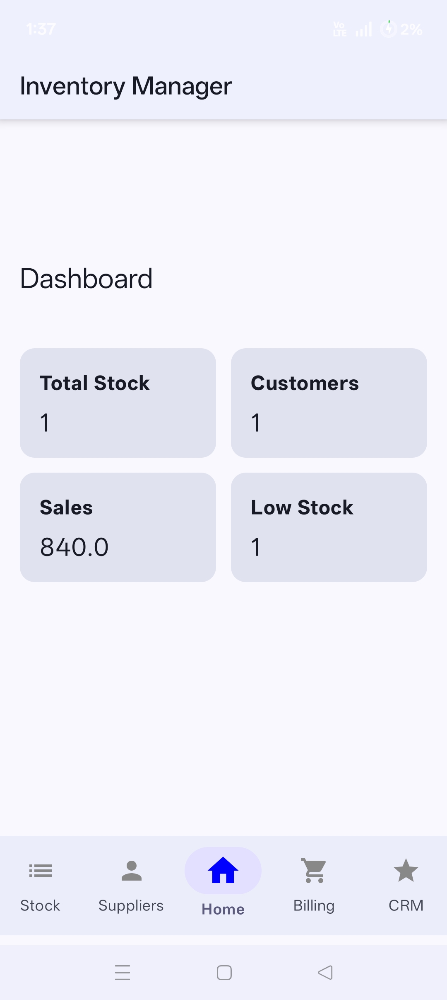

### Stock Screen
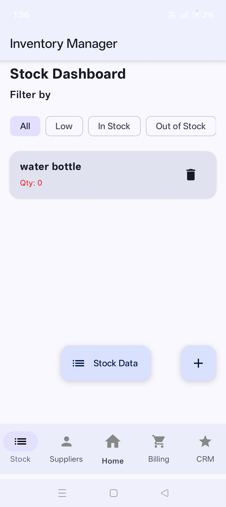

### Stock Details
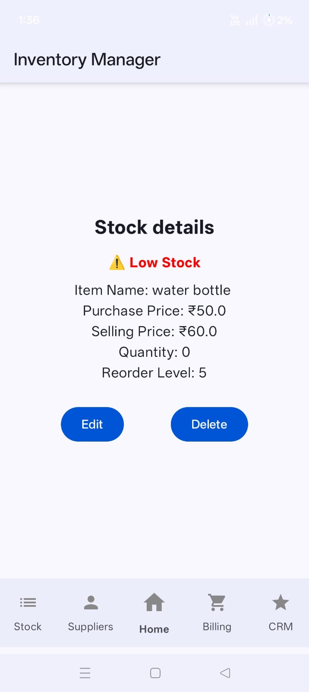

### Stock Data
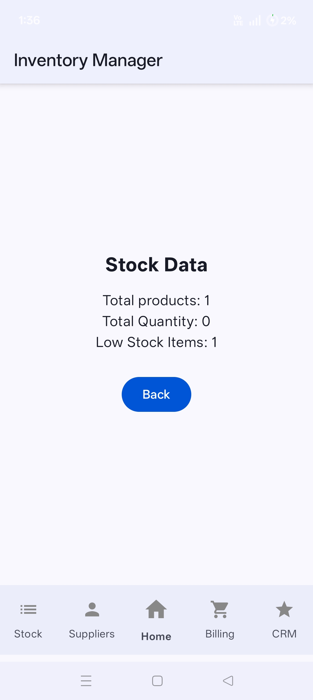

### Add Stock
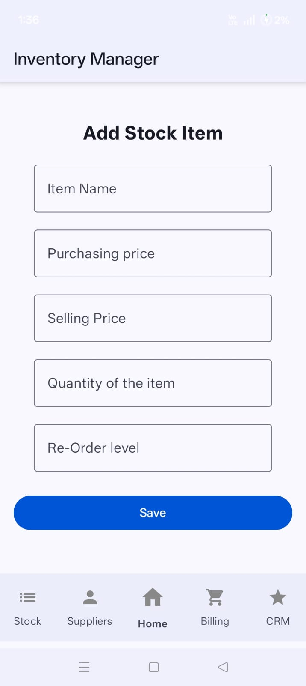

### Add Supplier
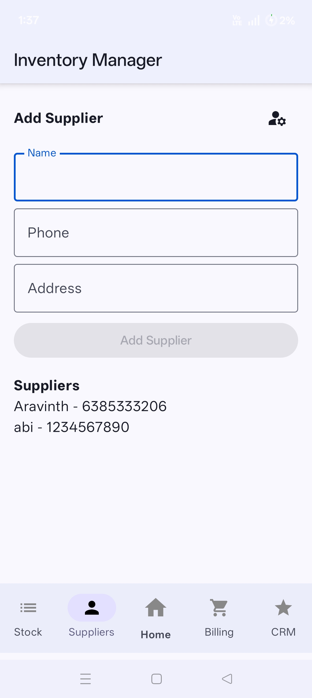

### Billing - Generate Bill
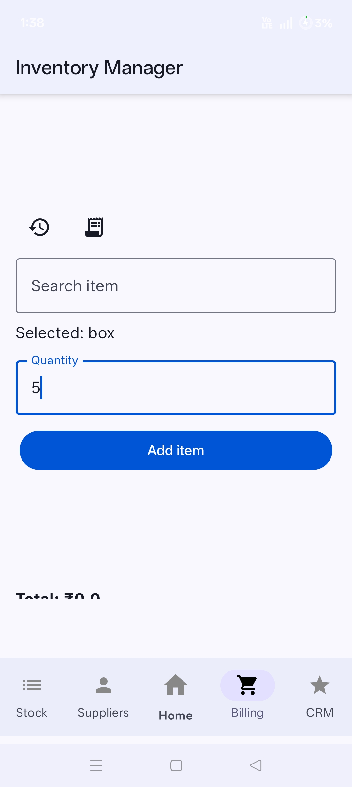

### Billing - Generate Bill (Step 2)
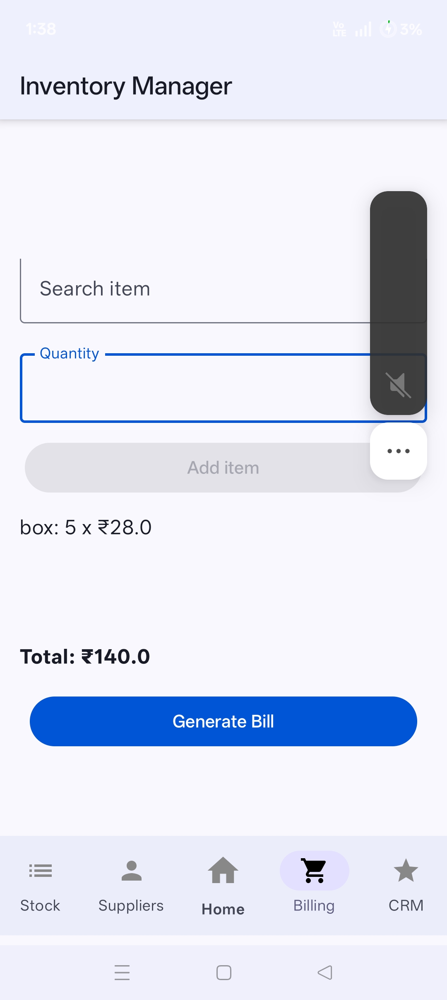

### Bill Details
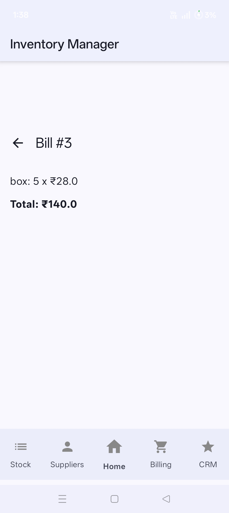

### Bill History
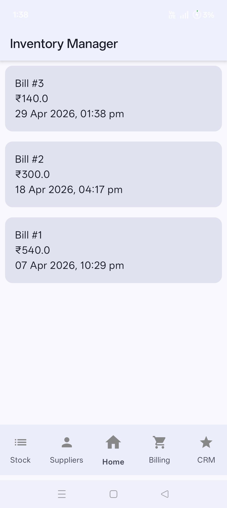

### CRM
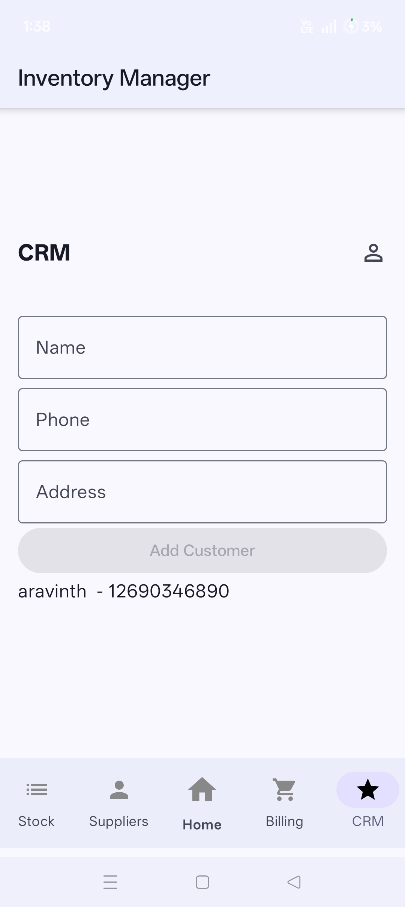